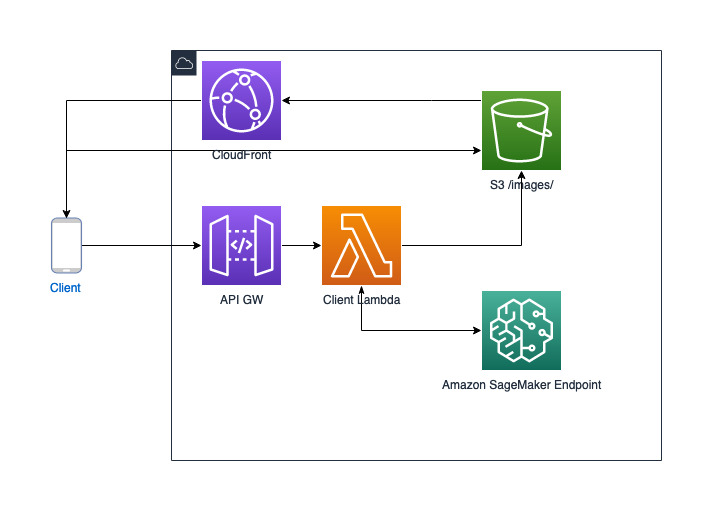

# Amazon SageMaker inference using Tensorflow Hub ready model

## Description

This sample code repo will demonstrate how we can use a ready model found on [Tensorflow Hub](https://www.tensorflow.org/hub/) as a bring your own container to Amazon SageMaker, and use it as an endpoint for inference.

The model selected for this demonstration is an object detection model trained on Open Images V4 with ImageNet pre-trained Inception Resnet V2 as image feature extractor that can be found [here](https://tfhub.dev/google/faster_rcnn/openimages_v4/inception_resnet_v2/1)

The repository contains a [notebook](./build-deploy.ipynb) that will explain each step in the build and deploy process.

This notebook was tested on Amazon SageMaker Notebook Instance `ml.t3.medium` with `python3` environment with access to S3, ECR, Amazon SageMaker, and docker installed.

**Notice**: This sample code uses AWS Resources such as SageMaker Notebook Instance to run the notebook and
Amazon SageMaker endpoint with `ml.g4dn.xlarge` for inference,
please make sure to clean up to avoid additional costs when finishing reviewing this sample.

## Implementation

This project designed to run inference on images that were uploaded to S3. A possible architecture diagram that can use this:

1. A client upload an image to S3 and sends a POST request to API Gateway
2. API Gateway proxies the request to a lambda
3. Lambda sends an inference request to Amazon SageMaker
4. SageMaker returns the inference results to lambda
5. Lambda creates a new image according to the inference results and stores it in S3
6. Lambda returns a CloudFront URL back to the client to download the inference image

## Security

See [CONTRIBUTING](CONTRIBUTING.md#security-issue-notifications) for more information.

## License

This library is licensed under the MIT-0 License. See the LICENSE file.
